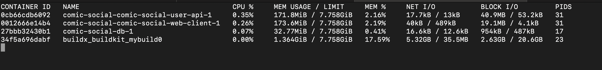
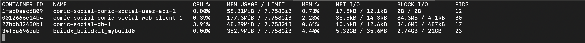
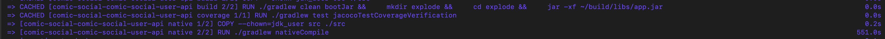

# Native Java compilation comparison

Tests were run for a preliminary startup comparison between running the User API as a native application, as opposed to running
with a JRE from an exploded jar. In general, the native application fared better for memory usage, startup time, and,
surprisingly to me, CPU usage. All of these benefits came with a hefty penalty encountered during the compilation process,
which took just over 9 minutes.

For each test, the API was hit to load data a single time. Obviously this is flawed but the test was more concerned with
initial statistics, rather than those over the lifetime of the application. In addition, it should be noted that GraalVM was
used for native compilation but not running the application.

These tests show the large disparities in memory usage, CPU usage, and startup time
that can be found when running a Java application on different JVMs, with different packaging... In particular, it 
shows the potential benefits of native compilation. Notably, it does not focus on the negative consequences. 

## Exploded jar with JRE

In this test, it took well over a second to start the application. The average time (over several runs) was closed to a single second.

The memory usage was around 171 MB and CPU usage was between 0.25% - 0.50%.

## Native compilation

In this test, it took 88 milliseconds to start the application. This was close to the average.

The memory usage was around 58 MB and CPU usage was between 0%.

As mentioned in the introduction, a large drawback was the very large compilation time of over 9 minutes. 

